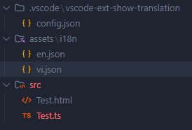
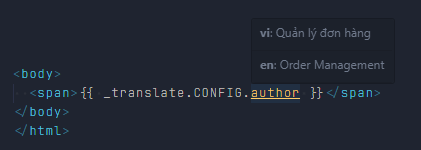
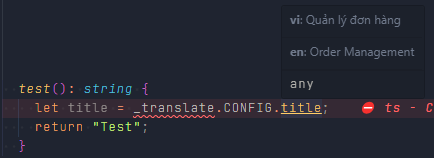
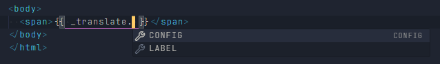
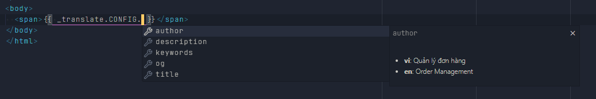
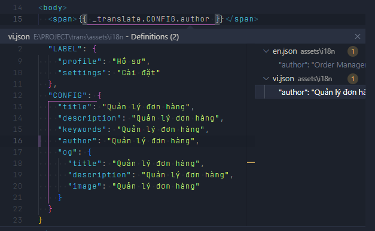
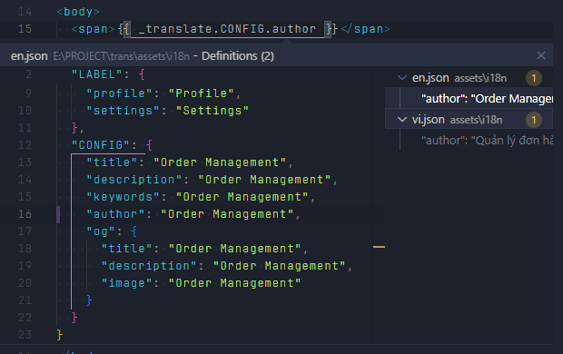

# Show translation in editor

- Extension supports displaying i18n (multilingual) content from JSON files

- Variable names (e.g. `this._translate`, `_translate`) and JSON file paths can be configured via `.vscode/vscode-ext-show-translation/config.json`

- Read the [configuration](#🔧-configuration) section below

## 💡 Features

- Show solution content from JSON files when hovering

- Suggest child key when typing `.` dot after translation variable

- Ctrl+Click to open the JSON file and move to the corresponding key location

## 🔧 Configuration

Create file: `.vscode/vscode-ext-show-translation/config.json`

```JSON
{
    "matchStrings": ["this._translate", "_translate"],
    "workInFiles": ["javascript", "typescript", "html"],
    "paths": [
        "src/assets/i18n/vi.json",
        "src/assets/i18n/en.json"
    ]
}
```



Paths to JSON data files may vary within each project. Please fill in the exact path to the JSON file, starting from the project's root directory. As in the example above, my JSON file is located at `<root-project>/src/assets/i18n/vi.json`

## 🐞 Note

- If hover/hint is not displayed: check the matchStrings in `show-translation.json`

- If you don't jump to the file: the key certainly exists in JSON

## 🖼️ Preview

Hover:





Completion Item:





Definition:





## 📚 Related documents

- [VSCode Extension API](https://code.visualstudio.com/api)
